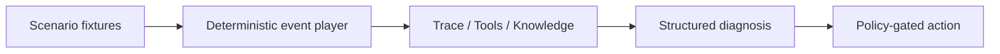

# Enterprise Support Copilot — Frontend V4

面向 FDE / AI Solution Engineer 作品集的企业 ERP 故障诊断控制台。它把 RAG 检索、工具调用、证据校验、结构化诊断和 Human-in-the-loop 写操作门禁放在同一条可演示、可复盘的链路里。

本版本使用确定性的合成数据，因此招聘者无需 API Key 就能稳定体验完整流程；界面不会伪装成正在调用真实生产系统。

## V3 体验重点

- 工作台默认加载一条完整的脱敏运行快照，`执行轨迹 / 工具调用 / 知识来源` 三个标签首次打开即有内容。
- 6 个可点击节点覆盖 `analyze_query → retrieve_knowledge → plan_tools → execute_tools → evidence_guard → compose_answer`。
- 工具详情展示 HTTP request、response、延迟、重试、side effect 和证据使用位置。
- 知识详情展示 chunk、hybrid retrieval、rerank score 与 citation validation。
- 4 个合成 ERP 场景，包含凭证、附件接口、差旅权限和公司范围 500。
- 高风险场景支持 `create_ticket` 的确认与拒绝两条确定性路径。
- 运行记录、工程视图、Code / JSON / Trace 以及 54 条 deterministic baseline 说明。
- 桌面与移动端布局、键盘焦点、Esc 关闭弹层和 reduced-motion。

## V4 视觉与交互升级

- 使用 GSAP timeline 为工作台、运行记录和工程视图建立统一的分层入场节奏。
- 标题按行揭示，卡片与表格采用 stagger；标签切换和证据列表使用轻量 transform/autoAlpha 动画。
- 所有动画均限制在 transform 与 opacity，并在组件更新/卸载时清理；`prefers-reduced-motion` 下自动跳过。
- 正文基线由原先的 7–10px 提升至 10–14px，重点覆盖运行表格、引用卡片、执行轨迹、工具调用和知识来源。
- 移动端运行记录改成原生卡片布局，不再依赖横向滚动；详情列表、指标、弹窗、底部导航和安全区均重新适配。

## Run locally

Requirements: Node.js 22.13 or newer.

```bash
npm ci
npm run dev
```

Production validation:

```bash
npm run build
npm test
```

## 推荐演示路径

1. 首页不执行任何操作，直接切换右侧三个标签并点开节点、工具和知识详情，说明“默认快照避免空白演示”。
2. 选择“公司范围 500”，点击开始诊断，观察执行阶段和右侧证据逐步解锁。
3. 诊断完成后点击“创建工单”，分别说明拒绝不产生写入，以及确认后使用 `run_id` 作为幂等键。
4. 打开“运行记录”，展示每次判断可复盘；打开“工程视图”，解释 REST 边界、证据门和 HITL。

更完整的话术见 [`docs/INTERVIEW_DEMO_SCRIPT.md`](docs/INTERVIEW_DEMO_SCRIPT.md)。

## 当前前端架构



The fixture schema already mirrors the future API response: category, confidence, retrieved documents, selected tools, tool results, root cause, recommendation, risk, and escalation flag.

## Project structure

```text
app/
  SupportConsole.tsx Product UI, fixtures, playback, evidence, history, engineering view
  page.tsx          Route entry
  globals.css       Visual system, layout, interaction, and responsive rules
  layout.tsx        Metadata and fonts
docs/
  HANDOFF.md        Current state and next-agent continuation guide
  INTERVIEW_DEMO_SCRIPT.md
  OPEN_SOURCE_ATTRIBUTION.md
LOCAL_AGENT_HANDOFF.md      China-accessible deployment handoff
FDE_INTERVIEW_PLAYBOOK.md   Demo narrative, capability map, and interview Q&A
PLAN.md             Milestones and scope boundaries
README.md           Setup and demo instructions
```

## 合成数据与指标说明

所有组织、用户、报销单、日志、制度、诊断、工单和时间均为作品集用合成数据。54 条评测结果来自项目已有 deterministic baseline 说明，不等同于生产模型准确率。

## 当前边界

该部署是可独立运行的前端演示版本。真实 FastAPI、LangGraph、向量检索和 Mock ERP 可按 [`docs/FULLSTACK_INTEGRATION.md`](docs/FULLSTACK_INTEGRATION.md) 中的契约接入；当前 UI 不依赖这些服务。

## Acknowledgements

Design principles were informed by UI/UX Pro Max and Emil Kowalski's public design-engineering guidance. The product direction also draws architectural inspiration from LangChain Agent Chat UI, LangGraph lifecycle workshop patterns, and OpenAI Knowledge Retrieval. No reference repository was copied into this project.

See [docs/OPEN_SOURCE_ATTRIBUTION.md](docs/OPEN_SOURCE_ATTRIBUTION.md) for details.
