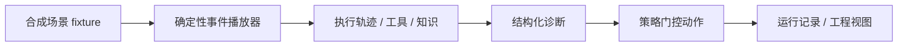

# Enterprise Support Copilot

> 面向企业 ERP 支持团队的「证据驱动故障诊断」Copilot 演示 —— 把知识检索、只读工具调用、证据校验、结构化诊断和 Human-in-the-loop 写操作审批放在**同一条可观察、可审计、可复盘的 Agent 工作流**里。

**在线体验（大陆可访问）**：https://2fab2b877a0c4f5a8077ecbff3fd1d11.app.workbuddy.link

> **诚实边界**：这是一个**确定性前端演示**。所有企业、用户、单据、日志、知识、工单和耗时均为合成数据；当前版本不调用真实 LLM / RAG / ERP / 生产接口。界面只展示安全的节点摘要、工具输入输出与证据，不展示模型私有 chain-of-thought。

---

## 它解决什么问题

企业支持的难点不是「生成一段听起来合理的答案」，而是：

- 制度知识、工单信息与系统状态分散在不同系统；
- 一线支持需要在有限时间内定位根因；
- 纯 LLM 容易在证据不足时补全事实；
- ERP 写操作涉及财务、权限与审计责任，不能让模型自行执行；
- 诊断过程必须能被支持经理、研发和审计人员复盘。

本项目把「回答问题」升级为「**收集证据 → 验证结论 → 控制行动**」的业务闭环。

## 核心能力

- **默认非空快照**：工作台首页即加载一条完整的脱敏运行，`执行轨迹 / 工具调用 / 知识来源` 首次打开就有内容，避免空面板演示。
- **六节点 Agent 工作流**：`analyze_query → retrieve_knowledge → plan_tools → execute_tools → evidence_guard → compose_answer`，每个节点可点开查看安全摘要、耗时与产出。
- **证据链交叉校验**：工具详情展示 HTTP request / response、延迟、重试、副作用（`side_effect`）与证据使用位置；知识详情展示 chunk、hybrid retrieval、rerank score 与引用校验。
- **4 个合成 ERP 场景**：凭证生成失败、附件同步超时、差旅权限、公司范围 500，覆盖低/中/高风险。
- **Human-in-the-loop 审批**：`create_ticket` 有确认与拒绝两条确定性路径 —— 拒绝不产生写操作；确认后才显示合成工单号，并以 `run_id` 表达幂等语义。
- **可复盘与工程视图**：运行记录可打开任意一次运行；Code / JSON / Trace 可切换与复制。
- **可达性与视觉**：桌面 + 移动端自适应、键盘焦点、Esc 关闭弹层、`prefers-reduced-motion` 下自动跳过动画。

## 技术栈

- **React 19 / Next.js 16 / TypeScript**（静态导出 `output: "export"`）
- **GSAP**（浏览器端动态加载，`gsap.context` + `matchMedia` 作用域管理，服务端零副作用）
- **Lucide**（图标）

## 快速开始

需要 Node.js `22.13+`。

```bash
npm ci          # 安装依赖（国内可加 --registry=https://registry.npmmirror.com）
npm run dev     # 本地开发 http://localhost:3000
```

生产校验（构建静态导出 + 3 个回归测试）：

```bash
npm run build   # 产出 out/
npm test        # 服务端首屏 / 非空证据 / 动效加载 3 个用例
npm run lint
```

## 演示路径（3–5 分钟）

1. 首页不做任何操作，直接切换右侧三个标签、点开节点/工具/知识详情 —— 说明「默认快照避免空白演示」。
2. 选择「公司范围 500」开始诊断，观察执行阶段与右侧证据逐步解锁。
3. 诊断完成后点「创建工单」，分别演示**拒绝不写入**、**确认后用 `run_id` 幂等**。
4. 打开「运行记录」说明每次判断可复盘；打开「工程视图」解释 REST 边界、证据门与 HITL。

完整话术见 [`docs/INTERVIEW_DEMO_SCRIPT.md`](docs/INTERVIEW_DEMO_SCRIPT.md)。

## 架构



fixture 的 schema 已镜像未来真实 API 的响应结构：`category / confidence / retrieved documents / selected tools / tool results / root cause / recommendation / risk / escalation flag`。接入真实后端时无需重写前端，详见 [`docs/FULLSTACK_INTEGRATION.md`](docs/FULLSTACK_INTEGRATION.md)。

## 项目结构

```text
app/
  SupportConsole.tsx   产品 UI、fixture、播放状态机、证据面板、诊断、审批、运行记录、工程视图
  page.tsx             路由入口
  layout.tsx           元数据与字体入口（系统字体栈，无构建期 Google Fonts 请求）
  globals.css          视觉系统、桌面/移动布局、交互与 reduced-motion
public/                站点图标等静态资源
tests/
  rendered-html.test.mjs  首屏 / 非空证据 / 动效加载回归测试
docs/
  FULLSTACK_INTEGRATION.md   前端 fixture → FastAPI / LangGraph 的接口契约
  INTERVIEW_DEMO_SCRIPT.md   3–5 分钟演示脚本
  HANDOFF.md                 当前状态与续作指南
  OPEN_SOURCE_ATTRIBUTION.md 设计与灵感来源归属
FDE_INTERVIEW_PLAYBOOK.md    面试讲解、FDE 能力映射与问答
```

> 仓库同时保留了从原 V4.1 交付（Cloudflare Workers / Vinext）迁移到 Next.js 静态导出的完整痕迹（`build/`、`worker/`、`db/`、`drizzle/`、`scripts/`、`vite.config.ts` 等），用于展示演进过程与全栈规划；当前「在线体验」与 `next build` 均使用静态导出路径。

## 部署

当前版本是单路由、无服务端 API / 登录 / 数据库的纯静态前端，推荐静态部署：

1. `npm run build` 产出 `out/`；
2. 将 `out/` 上传到任意静态托管（对象存储 + CDN、Nginx、EdgeOne Pages / CloudStudio 等）；
3. 默认首页设为 `index.html`，本项目只有根路由，不依赖 SPA rewrite。

中国大陆部署时已确认：无 Google Fonts、无跨域脚本/API/图片请求，首屏与静态资源全部可直连。详见 [`LOCAL_AGENT_HANDOFF.md`](LOCAL_AGENT_HANDOFF.md)。

## 合成数据与指标声明

- 所有组织、用户、报销单、日志、制度、诊断、工单与耗时均为**作品集用合成数据**。
- `54 cases`、`91.18% Retrieval hit@3` 等数字是 **deterministic baseline**，不是生产模型准确率。
- 界面只展示安全的节点摘要、工具输入输出与证据；不展示模型私有推理。

## 面试资料

- [`FDE_INTERVIEW_PLAYBOOK.md`](FDE_INTERVIEW_PLAYBOOK.md) —— 一句话定位、端到端工作流、FDE 能力映射、诚实缺口与问答。
- [`docs/INTERVIEW_DEMO_SCRIPT.md`](docs/INTERVIEW_DEMO_SCRIPT.md) —— 3–5 分钟结构化演示脚本。

## 边界与下一步

这是可独立运行的演示版本。真实 FastAPI、LangGraph、向量检索与 Mock ERP 可按 [`docs/FULLSTACK_INTEGRATION.md`](docs/FULLSTACK_INTEGRATION.md) 的契约接入，并保留 fixture 作为离线 fallback；当前 UI 不依赖这些服务。

## Acknowledgements

设计原则受 UI/UX Pro Max 与 Emil Kowalski 的公开设计工程指导启发；产品方向借鉴了 LangChain Agent Chat UI、LangGraph 生命周期 workshop 模式与 OpenAI Knowledge Retrieval 的架构思路。未复制任何参考仓库。详见 [`docs/OPEN_SOURCE_ATTRIBUTION.md`](docs/OPEN_SOURCE_ATTRIBUTION.md)。
