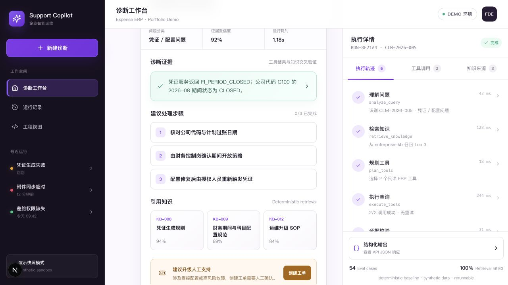
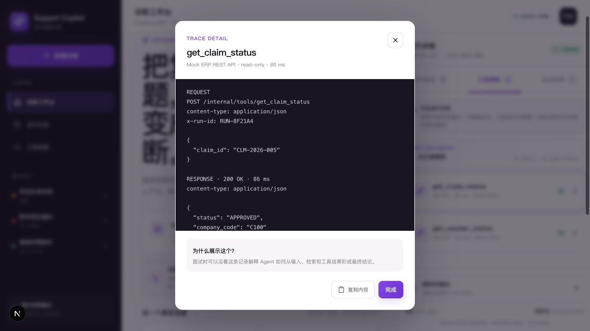
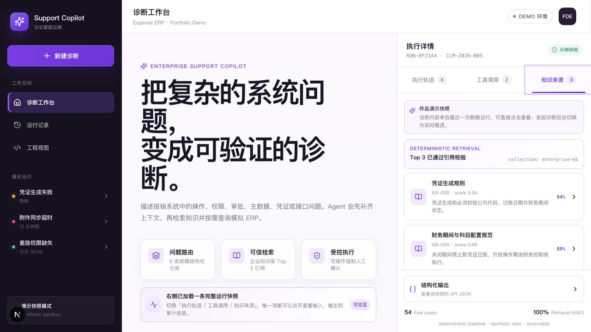
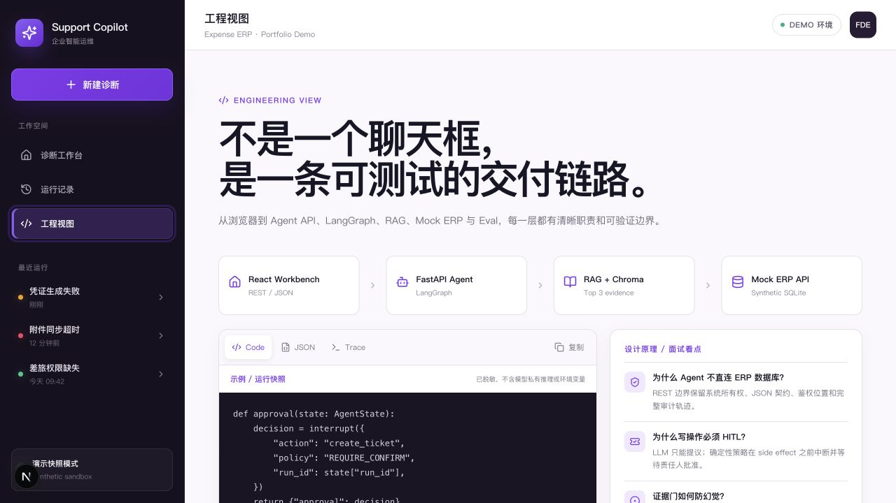
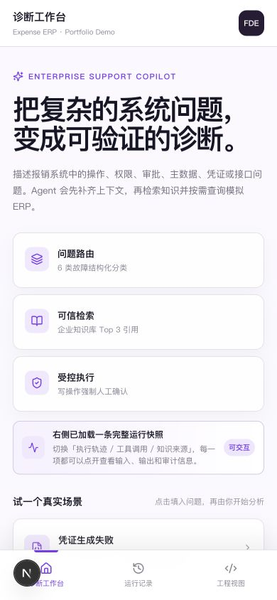
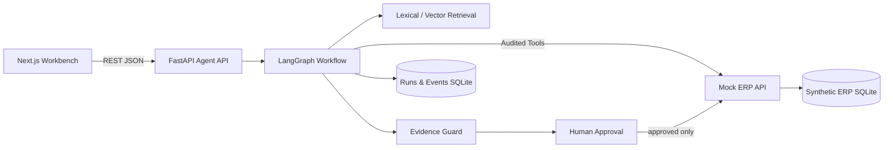

<div align="center">

# 🛡️ Enterprise Support Copilot

### 证据驱动的企业 ERP 故障诊断 Agent

把用户问题、企业知识、ERP 事实和人工审批串成一条可观察、可校验的诊断链路。

[](https://nextjs.org/)
[](https://fastapi.tiangolo.com/)
[](https://www.python.org/)
[](LICENSE)

[系统架构](docs/ARCHITECTURE.md) · [面试演示脚本](docs/INTERVIEW_DEMO_SCRIPT.md) · [评测结果](backend/evals/results/latest.md)



</div>

> 当前仓库尚未启用 GitHub Pages。上图来自本地运行的真实页面，不是概念稿。

## 目录

- [🚀 快速开始](#快速开始)
- [🖼️ 产品界面](#产品界面)
- [🎯 它解决什么问题](#它解决什么问题)
- [🎬 推荐演示路径](#推荐演示路径)
- [🧠 系统如何工作](#系统如何工作)
- [🔀 运行模式](#运行模式)
- [🔌 API](#api)
- [📊 测试与评测](#测试与评测)
- [🌍 部署到 GitHub Pages](#部署到-github-pages)
- [📁 项目结构](#项目结构)
- [⚠️ 项目边界](#项目边界)

## 🚀 快速开始

### 方式一：Docker Compose

要求：Docker Desktop 或兼容的 Docker Compose 环境。

```bash
docker compose up --build
```

打开 `http://localhost:3000`。Agent API 和 Mock ERP 分别监听 `8000`、`8001` 端口。

### 方式二：本地运行三个服务

要求：Node.js 22.13+、Python 3.11+、npm 和 [uv](https://docs.astral.sh/uv/)。

1. 安装依赖。

   ```bash
   npm ci
   cd backend && uv sync --extra dev && cd ..
   ```

2. 在第一个终端启动 Mock ERP。

   ```bash
   cd backend && uv run uvicorn services.mock_erp.app.main:app --port 8001
   ```

3. 在第二个终端启动 Agent API。

   ```bash
   cd backend && uv run uvicorn services.agent_api.app.main:app --port 8000
   ```

4. 在第三个终端启动前端。

   ```bash
   NEXT_PUBLIC_AGENT_API_URL=http://localhost:8000 npm run dev
   ```

5. 打开 `http://localhost:3000`。

如果不设置 `NEXT_PUBLIC_AGENT_API_URL`，前端会明确显示“演示快照模式”，并使用合成离线数据。

<details>
<summary><strong>接入 OpenAI-compatible 模型与向量检索</strong></summary>

1. 复制环境变量示例。

   ```bash
   cp backend/.env.example backend/.env
   ```

2. 修改以下配置。

   ```dotenv
   LLM_PROVIDER=openai_compatible
   RETRIEVAL_PROVIDER=vector
   LLM_API_KEY=your-key
   LLM_BASE_URL=https://your-provider.example/v1
   LLM_MODEL=your-model
   EMBEDDING_MODEL=your-embedding-model
   ```

3. 按“本地运行三个服务”重新启动后端和前端。

不要把真实密钥提交到 Git。不要把模型密钥写入浏览器端代码。

</details>

## 🖼️ 产品界面

下面的图片都来自本地运行页面。示例使用合成数据，不包含真实企业信息。

<table>
  <tr>
    <td width="50%" align="center">
      
      <br /><strong>🔧 工具调用审计</strong>
      <br /><sub>查看输入、HTTP 响应、耗时、重试次数和 side effect 状态。</sub>
    </td>
    <td width="50%" align="center">
      
      <br /><strong>📚 知识来源</strong>
      <br /><sub>展示 Top 3 检索结果、文档编号、分数和引用校验状态。</sub>
    </td>
  </tr>
  <tr>
    <td width="70%" align="center">
      
      <br /><strong>🏗️ 工程视图</strong>
      <br /><sub>说明前端、Agent API、LangGraph、RAG 和 Mock ERP 的职责边界。</sub>
    </td>
    <td width="30%" align="center">
      
      <br /><strong>📱 移动端工作台</strong>
      <br /><sub>在 390 × 844 视口下保留完整诊断入口。</sub>
    </td>
  </tr>
</table>

## 🎯 它解决什么问题

企业支持的风险不是 Agent 回答“我不知道”，而是它在缺少业务证据时仍给出确定结论。

Enterprise Support Copilot 为每次诊断设置三条边界：

1. 制度与操作规范来自企业知识检索。
2. 单据、权限、审批、凭证和接口状态来自受控 ERP 工具。
3. 模型负责提出结论，确定性代码负责校验证据并拦截未审批写入。

项目覆盖操作、权限、审批、主数据、凭证配置和接口异常六类合成场景。

| 能力 | 实现 | 作用 |
|:---|:---|:---|
| 🧠 Agent workflow | LangGraph 状态图与可恢复运行 | 让诊断步骤可观察 |
| 📚 Enterprise RAG | 12 份合成知识文档，lexical / vector 双模式 | 提供可追溯的制度依据 |
| 🔧 Tool use | 独立 Mock ERP REST API，只读工具白名单 | 防止模型猜测业务事实 |
| 🛡️ Evidence Guard | 校验 citation、`evidence_id` 和置信度 | 移除不属于本次运行的证据 |
| ✋ Human-in-the-loop | `create_ticket` 前 interrupt / resume | 阻止未经批准的写操作 |
| 📊 Evaluation | 54 条标注合成案例与六类指标 | 提供可重复的基线评测 |

## 🎬 推荐演示路径

| 输入 | 观察重点 | 预期结果 |
|:---|:---|:---|
| `CLM-2026-005 为什么凭证生成失败？` | 凭证工具、知识引用、人工审批 | 定位 `FI_PERIOD_CLOSED`，建议创建 P2 工单 |
| `CLM-2026-007 附件同步接口为什么失败？` | 接口日志、风险分级 | 识别连续 HTTP 504，升级 P1 |
| `用户 U1002 提交差旅报销时提示没有权限` | 用户权限、权限规范 | 找出缺失权限，不建议绕过控制 |

面试时可按 [3–5 分钟演示脚本](docs/INTERVIEW_DEMO_SCRIPT.md) 展示执行轨迹、工具调用、知识来源和审批恢复。

## 🧠 系统如何工作

```text
用户问题
  ↓
问题分类与实体提取
  ↓
检索企业知识 Top-K
  ↓
规划并执行只读 ERP 工具
  ↓
Evidence Guard 校验引用与工具证据
  ↓
输出结构化诊断、置信度与升级建议
  ↓
写操作前暂停，等待人工审批
```



- Agent 不能直接读取 ERP 数据库。业务事实通过 REST/JSON 工具边界读取。
- 只读工具白名单、参数校验和写操作审批由确定性代码执行。
- 引用必须属于本次检索。工具证据必须引用本次运行产生的 `evidence_id`。
- 有效证据不足时，系统降低置信度并说明不确定性。
- 运行事件只保存安全摘要，不保存模型私有推理。

详见 [Architecture](docs/ARCHITECTURE.md) 和 [Full-stack integration](docs/FULLSTACK_INTEGRATION.md)。

## 🔀 运行模式

| 模式 | 模型 | 检索 | ERP | 用途 |
|:---|:---|:---|:---|:---|
| 公开静态演示 | 前端确定性快照 | 前端快照 | 前端快照 | 无后端浏览完整界面 |
| 本地全栈（默认） | deterministic baseline | lexical retrieval | Mock ERP API | 无密钥复现、测试和面试 |
| 模型全栈 | OpenAI-compatible LLM | vector retrieval | Mock ERP API | 验证真实模型输出与 RAG |

如果已配置的 Agent API 不可用，前端会显示警告并降级到离线快照。界面不会把快照标成实时运行。

## 🔌 API

Agent API 的主要端点：

| 方法 | 路径 | 用途 |
|:---|:---|:---|
| `POST` | `/api/v1/chat/invoke` | 创建诊断运行 |
| `POST` | `/api/v1/runs/{run_id}/resume` | 批准或拒绝待审批写操作 |
| `GET` | `/api/v1/runs/{run_id}` | 读取运行记录 |
| `GET` | `/api/v1/runs/{run_id}/events` | 读取安全事件序列 |
| `GET` | `/health` | 检查 Agent API 健康状态 |

请求示例：

```bash
curl -X POST http://localhost:8000/api/v1/chat/invoke \
  -H 'Content-Type: application/json' \
  -d '{"message":"CLM-2026-005 为什么凭证生成失败？"}'
```

## 📊 测试与评测

运行前端构建、前端静态测试、后端测试和 Agent 评测：

```bash
npm run test:all
```

最近一次 deterministic baseline 结果：

<!-- EVAL_METRICS_START -->
Actual run: `2026-08-25T17:44:08.036977+00:00` · provider `deterministic` · model
`deterministic-baseline-v2` · 54 cases ·
0 execution failures.

| Metric | Actual score |
|---|---:|
| Classification accuracy | 100.00% |
| Tool selection accuracy | 100.00% |
| Retrieval hit@3 | 100.00% |
| Escalation accuracy | 100.00% |
| Citation coverage | 100.00% |
| Evidence reference validity | 100.00% |
<!-- EVAL_METRICS_END -->

这些分数只表示 54 条人工标注合成案例在确定性基线上的可复现表现。它们不代表生产模型准确率或真实故障解决率。

## 🌍 部署到 GitHub Pages

GitHub Pages 只能托管构建后的 HTML、CSS 和 JavaScript。它可以运行离线快照模式，但不能运行 FastAPI、LangGraph、SQLite 或 Mock ERP。

当前仓库已使用 Next.js 静态导出，但还没有配置仓库子路径和发布分支。仓库名为 `enterprise-support-copilot` 时，完成部署后的默认地址为：

```text
https://violetloveai.github.io/enterprise-support-copilot/
```

1. 在 `next.config.ts` 中为 Pages 构建添加 `basePath` 和 `assetPrefix`。

2. 安装 `gh-pages`。

   ```bash
   npm install --save-dev gh-pages
   ```

3. 构建仓库子路径版本。

   ```bash
   GITHUB_PAGES=true npm run build
   touch out/.nojekyll
   ```

4. 发布 `out/`。

   ```bash
   npx gh-pages -d out
   ```

5. 打开仓库的 **Settings → Pages**。

6. 将 **Source** 设为 **Deploy from a branch**。

7. 选择 `gh-pages` 分支和 `/(root)` 目录，然后保存。

部署完成后，检查首页、静态资源、刷新、移动端布局和浏览器控制台。完整配置说明见 [GitHub Pages 发布说明](docs/GITHUB_PAGES.md)。

如需在线运行真实 Agent，还要把 Agent API 和 Mock ERP 部署到可运行容器的云服务。然后在前端构建时设置公网 HTTPS `NEXT_PUBLIC_AGENT_API_URL`，并更新后端 CORS 来源。

## 📁 项目结构

```text
enterprise-support-copilot/
├── app/                         # Next.js 工作台、API client、离线 fallback
├── backend/services/agent_api/  # LangGraph、RAG、工具、证据门、运行记录
├── backend/services/mock_erp/   # 独立合成 ERP REST API
├── backend/knowledge_base/      # 12 份合成企业知识文档
├── backend/tests/               # unit / integration / e2e
├── backend/evals/               # 54 条 ground truth 与评测 runner
├── docs/                        # 架构、集成、演示与发布说明
└── docker-compose.yml           # 三服务全栈启动
```

## ⚠️ 项目边界

- 组织、用户、单据、接口日志、知识文档和工单均为合成数据。
- 默认本地模式不调用外部模型。只有配置 endpoint 后才运行真实模型与向量检索。
- 项目尚未包含真实客户数据、SSO、租户隔离、生产 ERP 写权限或不可抵赖审计。
- 代码由作者在 AI 辅助下完成。架构取舍、实现、测试、评测与文档均可在仓库中追溯。
- 第三方依赖和许可证说明见 [THIRD_PARTY_NOTICES.md](THIRD_PARTY_NOTICES.md)。

## 📄 License

[MIT](LICENSE)

<div align="center">

**每个结论都要回答：证据在哪里？**

</div>
