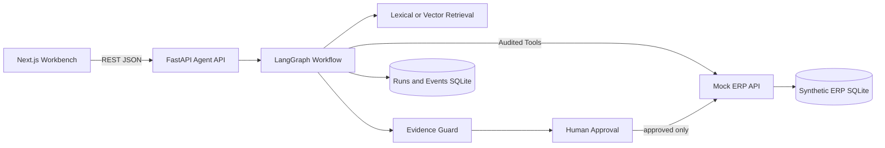

# Enterprise Support Copilot

面向企业 ERP 支持团队的证据驱动故障诊断 Copilot。它把问题分类、企业知识检索、只读 ERP 工具、证据校验、结构化诊断和 Human-in-the-loop 写操作审批放进同一条可观察、可审计、可复现的 Agent 工作流。

**在线演示（大陆可访问）**：https://2fab2b877a0c4f5a8077ecbff3fd1d11.app.workbuddy.link

> **诚实边界**：项目中的组织、用户、单据、接口日志、知识文档和工单均为合成数据。公开站点默认使用确定性快照，保证没有密钥和后端时也能演示；本仓库同时包含已经接通的 FastAPI、LangGraph、检索、Mock ERP、SQLite、HITL 与评测链路。默认本地模式不调用外部模型，配置 OpenAI-compatible endpoint 后才会运行真实模型与向量检索。它不是生产系统，也没有真实客户数据、SSO、租户隔离或生产 ERP 写权限。

## 为什么需要它

企业支持最危险的情况不是“没有答案”，而是系统给出一个听起来合理、实际没有证据的答案。本项目把工作流拆成三个明确边界：

1. 企业制度和操作规范通过检索获得；
2. 单据、权限、审批、凭证与接口状态必须通过受控工具查询；
3. 模型只能提出结论和动作，确定性策略负责验证证据并阻止未审批写入。

当前覆盖操作、权限、审批、主数据、凭证配置和接口异常六类合成场景。

## 三种运行模式

| 模式 | 模型 | 检索 | ERP | 用途 |
|---|---|---|---|---|
| 公开演示 | 前端确定性快照 | 前端快照 | 前端快照 | HR/面试稳定体验 |
| 本地全栈（默认） | deterministic baseline | lexical retrieval | Mock ERP REST API | 无密钥复现与测试 |
| 模型全栈 | OpenAI-compatible LLM | vector retrieval | Mock ERP REST API | 验证结构化输出与 RAG |

前端设置 `NEXT_PUBLIC_AGENT_API_URL` 后会消费真实 API 返回的 run、检索片段、工具结果、事件轨迹和审批状态；API 不可用时会明确提示并降级到离线快照。

## 架构



关键设计：

- Agent 不能直接读取 ERP 数据库，所有业务事实都跨 REST/JSON 工具边界；
- 只读工具白名单与参数校验由确定性代码执行；
- 引用必须属于本次检索，工具证据必须引用本次运行产生的 `evidence_id`；
- 没有有效工具证据或知识引用时自动降低置信度并声明不确定性；
- 高风险诊断强制升级人工；`create_ticket` 在 LangGraph interrupt 后才能恢复执行；
- run events 只保存安全摘要，不展示或持久化模型私有推理。

详细说明见 [`docs/ARCHITECTURE.md`](docs/ARCHITECTURE.md)。

## 快速开始

### 方式一：Docker Compose

```bash
docker compose up --build
```

打开 `http://localhost:3000`。Agent API 和 Mock ERP 分别位于 `8000`、`8001`。

### 方式二：本地进程

要求 Node.js 22.13+、Python 3.11+、npm 和 [uv](https://docs.astral.sh/uv/)。

```bash
npm ci
cd backend && uv sync --extra dev && cd ..
```

分别启动三个进程：

```bash
cd backend && uv run uvicorn services.mock_erp.app.main:app --port 8001
cd backend && uv run uvicorn services.agent_api.app.main:app --port 8000
NEXT_PUBLIC_AGENT_API_URL=http://localhost:8000 npm run dev
```

默认就是无需密钥的 deterministic + lexical 模式。

### 接入模型与向量检索

```bash
cp backend/.env.example backend/.env
```

在 `backend/.env` 中设置：

```dotenv
LLM_PROVIDER=openai_compatible
RETRIEVAL_PROVIDER=vector
LLM_API_KEY=your-key
LLM_BASE_URL=https://your-provider.example/v1
LLM_MODEL=your-model
EMBEDDING_MODEL=your-embedding-model
```

密钥不得提交到 Git。

## 测试与评测

```bash
npm run test:all
```

当前重新执行的 deterministic baseline：

<!-- EVAL_METRICS_START -->
Actual run: `2026-08-25T16:36:43.300736+00:00` · provider `deterministic` · model
`deterministic-baseline-v2` · 54 cases ·
0 execution failures.

| Metric | Actual score |
|---|---:|
| Classification accuracy | 100.00% |
| Tool selection accuracy | 100.00% |
| Retrieval hit@3 | 100.00% |
| Escalation accuracy | 100.00% |
| Citation coverage | 100.00% |
| Evidence reference validity | 100.00% |
<!-- EVAL_METRICS_END -->

这些结果只说明54条人工标注合成案例在确定性基线上的可复现表现，不代表生产模型准确率、真实故障解决率或客户业务价值。原始逐案例结果在 [`backend/evals/results/latest.json`](backend/evals/results/latest.json)。

## 项目结构

```text
app/
  SupportConsole.tsx       产品工作台与离线 fallback
  support-api.ts           FastAPI 客户端与响应类型
backend/
  services/agent_api/      LangGraph、RAG、工具、证据门、运行记录
  services/mock_erp/       独立合成 ERP REST API
  knowledge_base/          12 份合成企业知识文档
  data/synthetic/          合成业务数据
  tests/                   unit / integration / e2e
  evals/                   54 条 ground truth 与 runner
docker-compose.yml         三服务全栈启动
docs/                      架构、接口、演示与面试说明
```

## 开发归属说明

这是一个 AI 辅助开发作品。业务问题定义、产品范围、交互取舍、验收标准和多轮测试由项目作者负责；架构方案与代码实现经过 Coding Agent 协作，并由作者持续调试和验收。仓库没有改造现成开源项目；第三方依赖与设计参考见 [`THIRD_PARTY_NOTICES.md`](THIRD_PARTY_NOTICES.md) 和 [`docs/OPEN_SOURCE_ATTRIBUTION.md`](docs/OPEN_SOURCE_ATTRIBUTION.md)。

## 下一步生产化缺口

- 企业 SSO、RBAC、租户隔离与数据保留策略；
- 对工具网关的服务端授权、审批人身份和不可抵赖审计；
- 真实支持团队 discovery、历史工单评测和线上业务指标；
- 对模型模式分别评估拒答、错误高置信、引用忠实度和端到端任务成功率；
- 将公开前端与独立部署的 Agent API 安全连接，而不是把模型密钥放进浏览器。
